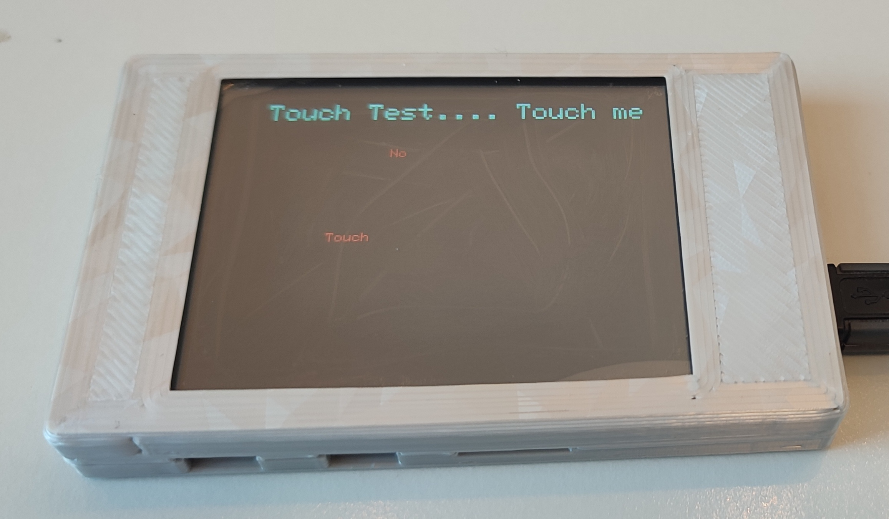
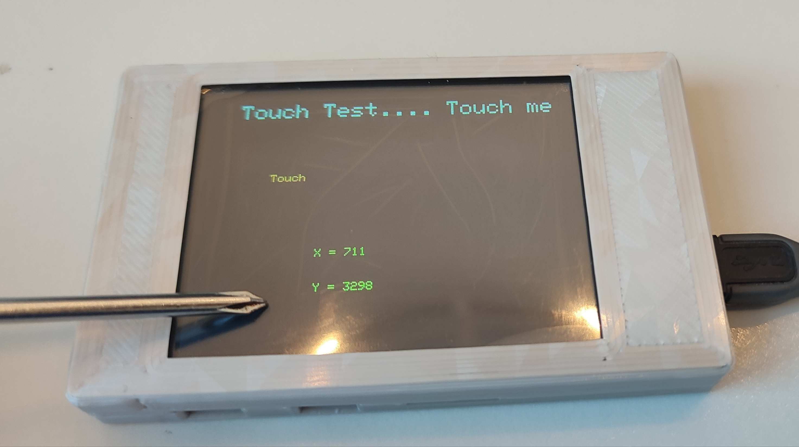

# Cheap Yellow Display Example

This project is a [PlatformIO](https://platformio.org/) project with a modified version of the test program(s) for the Adafruit ILI9341 & touch library
applied to the Sutton Smar Display ESP32-2432S028R board aka Cheap Yellow Display / CYD.

Sharing this as I had some initial hurdles getting this board to run with thse standard libraries

## Dependencies

The dependencies are automatically resolved via [PlatformIO](https://platformio.org/)

	adafruit/Adafruit GFX Library@^1.11.9
	adafruit/Adafruit ILI9341@^1.6.0
	https://github.com/PaulStoffregen/XPT2046_Touchscreen.git

Note: use the latest version of the XPT2046_Touchscreen library, the build-in version in PlatformIO is long outdated.


## How to get the XPT2046 and ILI9341 working
Key elements to get it working:

Use 2 SPI classes:

```
SPIClass hspi = SPIClass(HSPI);
SPIClass vspi = SPIClass(VSPI);
```

Initializes the touchscreen while passing the SPI Class:

`Adafruit_ILI9341 tft = Adafruit_ILI9341(&hspi, TFT_DC, TFT_CS, TFT_RST);`

Setup the VSPI to use custom pins for the touch and pass it in the tf.begin():
  
```
vspi.begin(XPT2046_CLK, XPT2046_MISO, XPT2046_MOSI, XPT2046_CS);
ts.begin(vspi);
```

## What is Cheap Yellow Display

There is a range of small development boards, together with screen and touch sensors that are available 
ESP32-2432S028R is one variant of the family.

Specifications:

2.8" ESP32 Module ESP32-2432S028R

WiFi+BT Dual-core

240X320 Resistive LCD Touchscreen


Case used in the images:

https://www.printables.com/model/726960-sunton-esp32-2432s028r-cheap-yellow-display-back-p

To use the display with [LVGL](https://lvgl.io/) drivers see https://github.com/rzeldent/esp32-smartdisplay.

Fould also https://github.com/witnessmenow/ESP32-Cheap-Yellow-Display which has lot of usefull code for these displays

 


